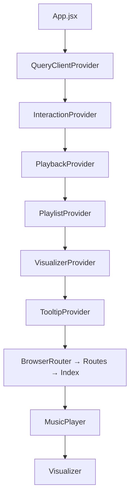

# Architecture — Darkwave Visualizer Player

The app is a single-page player with three concerns cleanly split into
providers. Each provider owns its state, exposes actions through a hook,
and stays unaware of the others' internals.

## Provider tree



Nesting order is intentional:

- **InteractionProvider** — first user gesture unlocks Web Audio; it must be
  above anything that depends on it.
- **PlaybackProvider** — owns the `<audio>` element and its state, so both
  PlaylistProvider and VisualizerProvider consume its `audioRef`.
- **PlaylistProvider** — owns the ordered track list + persistence. Depends on
  Playback for `loadTrack` and the `ended` bridge.
- **VisualizerProvider** — owns the canvas, the render loop, and the shared
  Web Audio graph. Depends on Playback for `audioRef` and on Interaction to
  know when it may create an `AudioContext`.

## Detailed docs

- [Playback + Playlist](./playback.md) — audio element, track list, persistence.
- [Visualizer](./visualizer.md) — provider, backend contract, preset manager,
  Milkdrop vs Shadertoy backends.

## Where things live

```
src/
  providers/
    InteractionProvider.jsx
    PlaybackProvider.jsx
    PlaylistProvider.jsx
    VisualizerProvider.jsx
  storage/
    localPlaylistStore.js      # PlaylistStore contract, localStorage impl
  visualizer/
    config.js                  # DEFAULT_VISUALIZER_CONFIG
    backends/
      MilkdropBackend.js       # butterchurn wrapper
      ShaderBackend.js         # Shadertoy stub
    presets/
      MilkdropPresetManager.js
      ShaderPresetManager.js
  components/
    MusicPlayer.jsx            # UI only — reads all state via hooks
    Visualizer.jsx             # thin canvas view
```

## Object catalog (quick reference)

| Object | Owns | Exposed via |
|---|---|---|
| InteractionProvider | `isInteracted` (one-time first gesture), `isInteracting` (3 s activity window) | `useInteraction()` |
| PlaybackProvider | `<audio>` element, `isPlaying`, `currentTime`, `duration`, `volume`, `error`, `currentTrack` | `usePlayback()` |
| PlaylistProvider | `playlist[]`, `playlistName`, `currentIndex`, persisted playback state | `usePlaylist()` |
| VisualizerProvider | canvas, backend instance, RAF loop, cycle timer, AudioContext + graph | `useVisualizer()` |
| PlaylistStore | localStorage / (future) IndexedDB persistence | injected into PlaylistProvider |
| VisualizerBackend | GPU/renderer state + a PresetManager | held by VisualizerProvider |
| PresetManager | preset list, current index, history, cross-fade | `backend.presetManager` |

Each item has a full properties + behaviors + event-reactions section in the
per-topic doc.
