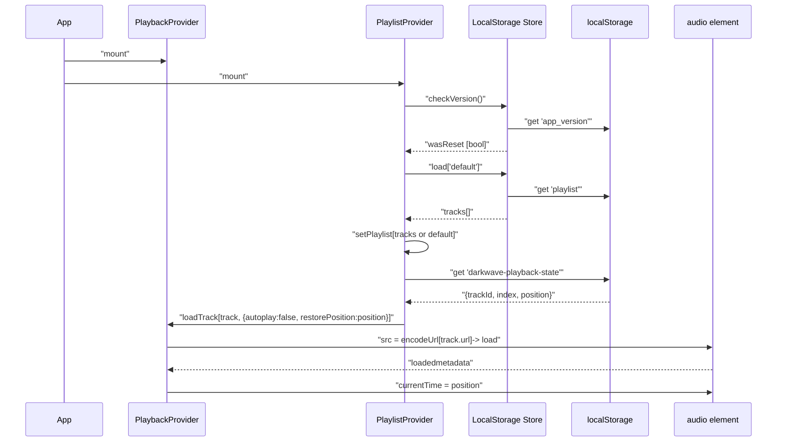
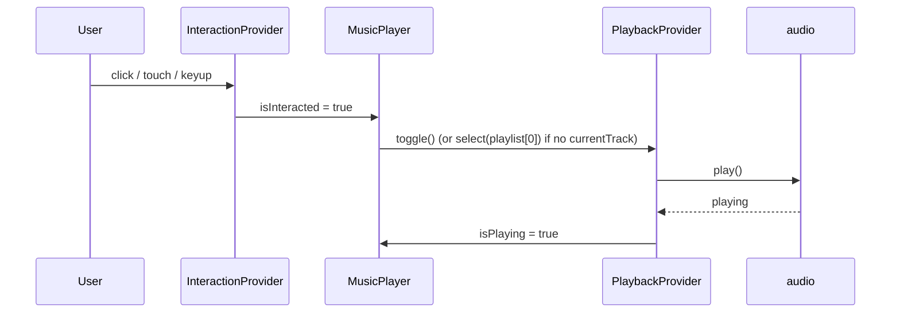
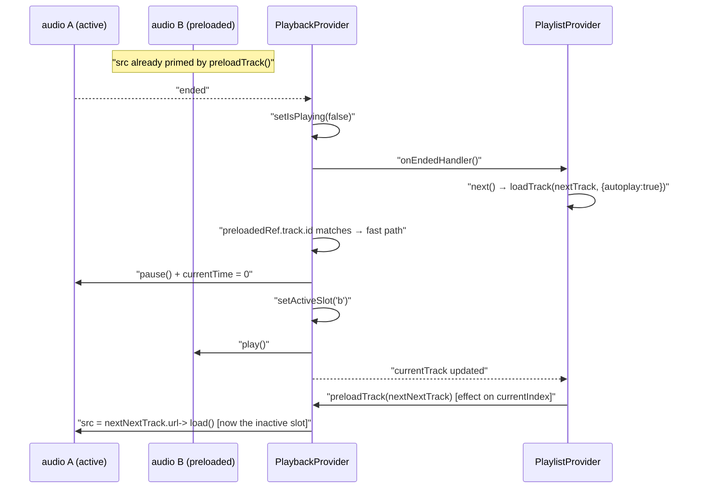
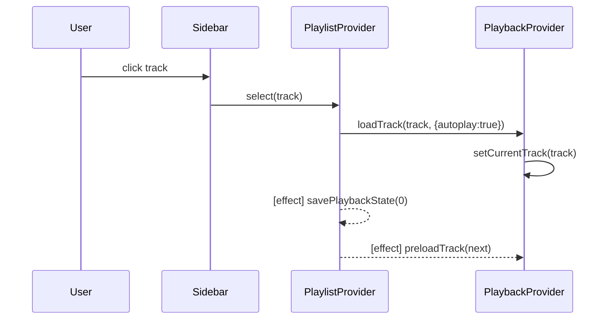

# Playback & Playlist

Two providers, one storage adapter. Playback owns the audio element and the
"is this playing right now" state. Playlist owns the ordered list and the
navigation actions (`next`, `prev`, `select`) and persists position across
reloads through the store.

## Objects

### PlaybackProvider — `src/providers/PlaybackProvider.jsx`

Owns **two `<audio>` elements ("A" and "B", ping-pong slots)** and every
fact about the sound the browser is making right now. Only one slot is
active at any moment; the other is used to preload the next track so
transitions are gapless and survive mobile JS throttling.

**Properties (via `usePlayback()`):**
- `audioRef` — the currently **active** `<audio>` element. Existing
  consumers keep working; new consumers that need both slots should read
  `audioRefs` instead.
- `audioRefs` — `{a, b}`, both refs. VisualizerProvider uses this to
  create a `MediaElementSource` for each slot and route both into the
  shared audio graph.
- `activeSlot` — `'a'` \| `'b'`. Flips on a fast-path swap.
- `currentTrack` — the track object whose URL is currently in
  `activeAudio.src`.
- `isPlaying` — boolean, updated by action rather than event.
- `currentTime`, `duration` — updated on the active slot's `timeupdate`.
- `volume` — 0.0–1.0, mirrored to **both** audio elements' `.volume`.
- `error` — last playback error string, or `null`.

**Behaviors:**
- `play()` — `activeAudio.play()`, handles Promise rejection → `error`.
- `pause()` — `activeAudio.pause()`.
- `toggle()` — pause if playing, play otherwise. Sets
  `error = 'No track selected'` when there is nothing to play.
- `seek(time)` — sets `activeAudio.currentTime` if `time` is finite.
- `setVolume(v)` — updates state + both `audio.volume`s.
- `loadTrack(track, {autoplay = true, restorePosition = null})`:
  - **Fast path**: when `preloadedRef.track.id === track.id` and no
    restorePosition, pause the old active, `setActiveSlot(preloaded.slot)`,
    and play the new active. No network fetch — the preloaded slot is
    already primed.
  - **Cold path**: on the active slot, `src = encodeUrl(...)`, `load()`,
    `play()` if autoplay. Stashes `restorePosition` for the next
    `loadedmetadata`. Clears any stale preload.
- `preloadTrack(track)` — sets `inactiveAudio.src = encodeUrl(track.url)`,
  calls `load()`, remembers `{track, slot}` for the fast-path check.
  Idempotent: no-op if the same track is already preloaded. Pass `null`
  to clear.
- `setOnEndedHandler(cb)` — single-slot callback fired when the active
  audio emits `ended`. PlaylistProvider registers itself here.

**Event reactions:** Both audio elements' events fire, but the handlers
short-circuit unless `event.currentTarget === activeAudio()` — so state
updates and the `ended` bridge only come from the currently playing slot.

| Event (active slot only) | Reaction |
|---|---|
| `timeupdate` | update `currentTime` + `duration`. |
| `loadedmetadata` | if `restoreTimeRef` is set, apply it to `audio.currentTime` and clear. |
| `ended` | flip `isPlaying = false`, then invoke the registered `onEnded` handler. |
| `error` | set `error` from `event.target.error.message`. |

### PlaylistProvider — `src/providers/PlaylistProvider.jsx`

**Properties (via `usePlaylist()`):**
- `playlist` — array of `{id, title, url, type}`.
- `playlistName` — string, shown in the sidebar input.
- `currentIndex` — derived from `playback.currentTrack.id`; `-1` if not in list.

**Behaviors:**
- `select(track)` — `playback.loadTrack(track, {autoplay: true})`.
- `next()` — select `playlist[currentIndex + 1]` when in range.
- `prev()` — select `playlist[currentIndex - 1]` when in range.
- `add(tracks)` — append tracks (used by file upload).
- `remove(id)` — filter by id.
- `reorder(from, to)` — splice-then-insert (used by drag-and-drop sidebar).
- `setPlaylistName(name)` — sidebar edit.
- `setPlaylist(list)` — bulk replace, used by hydration.

**Event reactions:**
| Event | Reaction |
|---|---|
| mount | `store.checkVersion()` → wipe playlist if version bumped; `store.load('default')` → seed state. |
| `playlist` change | `store.save('default', playlist)` (skipped when the list is empty). |
| first render with a non-empty playlist | hydrate `playback.currentTrack` + `restorePosition` from `localStorage['darkwave-playback-state']`. Set `skipNextSaveRef` so the immediate `currentTrack` change effect doesn't wipe the restored position. |
| `playback.currentTrack` change | `savePlaybackState(0)`, unless `skipNextSaveRef` is armed (hydration). |
| every 10 s while `currentTrack` is set | `savePlaybackState()` (uses live `audio.currentTime`). |
| unmount | `savePlaybackState()` — flush on tab close. |
| audio `ended` (via PlaybackProvider handler slot) | `next()`. |
| `currentIndex` or `playlist` change | `playback.preloadTrack(playlist[currentIndex + 1])` (or `null` when at the end). Fires on hydration, on manual `select`, on `next`/`prev`, and on drag-reorder. |

### PlaylistStore — `src/storage/localPlaylistStore.js`

Contract each backend must implement:

```
checkVersion() : boolean
list()         : Promise<PlaylistMeta[]>
load(id)       : Promise<Track[] | null>
save(id, list) : Promise<void>
delete(id)     : Promise<void>
```

The **LocalStoragePlaylistStore** is a thin factory around
`src/utils/versionCheck.js` (`checkAndClearPlaylist` / `getStoredPlaylist` /
`setStoredPlaylist`). Only one playlist (`id = 'default'`) is exposed today;
`list()` still returns an array so consumers already speak the multi-playlist
shape.

The future **IndexedDBPlaylistStore** drops in behind the same contract, with
one row per playlist and a metadata table for `list()`.

## Flows

### Hydration on first load



### First user gesture unlocks playback



### Track ends → next track (A/B fast path)



Before A/B preload the transition took a full fresh-fetch on the same
audio element; with the two-slot swap the browser plays a decoded buffer
that was already sitting in memory.

### Mobile lock-screen: why this used to break

When the phone is asleep or the browser tab is backgrounded, JS timers
throttle heavily and any new `audio.play()` outside a user gesture is
treated as autoplay and blocked. The chain above used to fail at the
final `play()` on the new active slot. Two changes fix it:

1. **A/B preload** removes the network round-trip so the play is
   immediate on the `ended` tick.
2. **MediaSessionBinder** registers a `nexttrack` action handler. When
   the OS advances the track (headset, lockscreen, notification), the
   handler runs in a Media-Session-privileged context; the `play()`
   that follows is treated as user-initiated.

The audio graph in VisualizerProvider also stops rendering (only) when
the tab is hidden, so no wasted GPU/CPU while backgrounded.

### Track selection from sidebar



### MediaSessionBinder — `src/components/MediaSessionBinder.jsx`

Headless. Composes `usePlayback()` + `usePlaylist()` and mirrors state
into the browser's Media Session API.

**Owned state:** none — pure side effect.

**Behaviors (one per effect):**
- On `currentTrack` or `playlistName` change → set
  `navigator.mediaSession.metadata` (title / artist / album / artwork).
- On `isPlaying` change → set
  `navigator.mediaSession.playbackState = 'playing' | 'paused'`.
- On mount / callback identity change → register action handlers:
  `play`, `pause`, `previoustrack`, `nexttrack`, `stop`, `seekto`,
  `seekbackward`, `seekforward`. Unregister on cleanup.
- On `currentTime` / `duration` change → `setPositionState(...)` so the
  lockscreen scrubber tracks.

**Event reactions:**
| OS event | Reaction |
|---|---|
| lockscreen ▶ / notification play | `playback.play()` |
| lockscreen ⏸ | `playback.pause()` |
| headset ⏭ / notification next | `playlist.next()` |
| headset ⏮ / notification prev | `playlist.prev()` |
| lockscreen scrub | `playback.seek(seekTime)` |
| voice assistant "stop music" | `playback.pause()` |

All calls to `navigator.mediaSession.*` are wrapped in `try/catch` so
browsers that only implement a subset of actions don't throw.

## Adding a new storage backend

1. Implement the `PlaylistStore` contract in a new file
   (e.g. `src/storage/indexedDbPlaylistStore.js`).
2. Pass it as the `store` prop to `<PlaylistProvider store={createIndexedDbPlaylistStore()}>`.

No provider or component needs to change.
