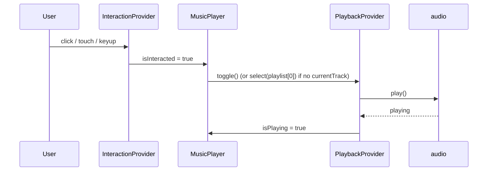
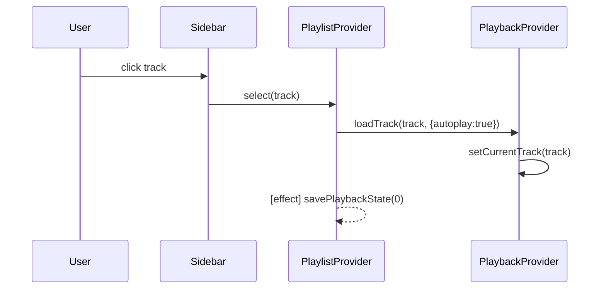

# Playback & Playlist

Two providers, one storage adapter. Playback owns the audio element and the
"is this playing right now" state. Playlist owns the ordered list and the
navigation actions (`next`, `prev`, `select`) and persists position across
reloads through the store.

## Objects

### PlaybackProvider — `src/providers/PlaybackProvider.jsx`

Owns the `<audio>` element and every fact about the sound the browser is
making right now.

**Properties (via `usePlayback()`):**
- `audioRef` — React ref to the `<audio>` element. Given out for
  `createMediaElementSource` in VisualizerProvider.
- `currentTrack` — the track object whose URL is currently in `audio.src`.
- `isPlaying` — boolean, mirrors `audio.paused` inversion but updated by
  action rather than event.
- `currentTime`, `duration` — updated on every `timeupdate`.
- `volume` — 0.0–1.0, mirrored to `audio.volume`.
- `error` — last playback error string, or `null`.

**Behaviors:**
- `play()` — `audio.play()`, handles Promise rejection → `error`.
- `pause()` — `audio.pause()`.
- `toggle()` — pause if playing, play otherwise. Sets `error = 'No track selected'`
  when there is nothing to play.
- `seek(time)` — sets `audio.currentTime` if `time` is finite.
- `setVolume(v)` — updates state + `audio.volume`.
- `loadTrack(track, {autoplay = true, restorePosition = null})` — sets
  `currentTrack`, `audio.src = encodeUrl(track.url)`, calls `audio.load()`, then
  `audio.play()` if `autoplay`. Stashes `restorePosition` for the next
  `loadedmetadata`.
- `setOnEndedHandler(cb)` — single-slot callback fired when `audio` emits
  `ended`. PlaylistProvider registers itself here to advance to the next track.

**Event reactions:**
| Event | Reaction |
|---|---|
| audio `timeupdate` | update `currentTime` + `duration`. |
| audio `loadedmetadata` | if `restoreTimeRef` is set, apply it to `audio.currentTime` and clear the ref. |
| audio `ended` | flip `isPlaying = false`, then invoke the registered `onEnded` handler. |
| audio `error` | set `error` from `event.target.error.message`. |

### PlaylistProvider — `src/providers/PlaylistProvider.jsx`

**Properties (via `usePlaylist()`):**
- `playlist` — array of `{id, title, url, type}`.
- `playlistName` — string, shown in the sidebar input.
- `currentIndex` — derived from `playback.currentTrack.id`; `-1` if not in list.

**Behaviors:**
- `select(track)` — `playback.loadTrack(track, {autoplay: true})`.
- `next()` — select `playlist[currentIndex + 1]` when in range.
- `prev()` — select `playlist[currentIndex - 1]` when in range.
- `add(tracks)` — append tracks (used by file upload).
- `remove(id)` — filter by id.
- `reorder(from, to)` — splice-then-insert (used by drag-and-drop sidebar).
- `setPlaylistName(name)` — sidebar edit.
- `setPlaylist(list)` — bulk replace, used by hydration.

**Event reactions:**
| Event | Reaction |
|---|---|
| mount | `store.checkVersion()` → wipe playlist if version bumped; `store.load('default')` → seed state. |
| `playlist` change | `store.save('default', playlist)` (skipped when the list is empty). |
| first render with a non-empty playlist | hydrate `playback.currentTrack` + `restorePosition` from `localStorage['darkwave-playback-state']`. Set `skipNextSaveRef` so the immediate `currentTrack` change effect doesn't wipe the restored position. |
| `playback.currentTrack` change | `savePlaybackState(0)`, unless `skipNextSaveRef` is armed (hydration). |
| every 10 s while `currentTrack` is set | `savePlaybackState()` (uses live `audio.currentTime`). |
| unmount | `savePlaybackState()` — flush on tab close. |
| audio `ended` (via PlaybackProvider handler slot) | `next()`. |

### PlaylistStore — `src/storage/localPlaylistStore.js`

Contract each backend must implement:

```
checkVersion() : boolean
list()         : Promise<PlaylistMeta[]>
load(id)       : Promise<Track[] | null>
save(id, list) : Promise<void>
delete(id)     : Promise<void>
```

The **LocalStoragePlaylistStore** is a thin factory around
`src/utils/versionCheck.js` (`checkAndClearPlaylist` / `getStoredPlaylist` /
`setStoredPlaylist`). Only one playlist (`id = 'default'`) is exposed today;
`list()` still returns an array so consumers already speak the multi-playlist
shape.

The future **IndexedDBPlaylistStore** drops in behind the same contract, with
one row per playlist and a metadata table for `list()`.

## Flows

### Hydration on first load

```mermaid
sequenceDiagram
  participant App
  participant PB as PlaybackProvider
  participant PL as PlaylistProvider
  participant Store as LocalStorage Store
  participant LS as localStorage
  participant AU as audio element

  App->>PB: mount
  App->>PL: mount
  PL->>Store: checkVersion()
  Store->>LS: get 'app_version'
  Store-->>PL: wasReset (bool)
  PL->>Store: load('default')
  Store->>LS: get 'playlist'
  Store-->>PL: tracks[]
  PL->>PL: setPlaylist(tracks or default)
  PL->>LS: get 'darkwave-playback-state'
  LS-->>PL: {trackId, index, position}
  PL->>PB: loadTrack(track, {autoplay:false, restorePosition:position})
  PB->>AU: src = encodeUrl(track.url); load()
  AU-->>PB: loadedmetadata
  PB->>AU: currentTime = position
```

### First user gesture unlocks playback



### Track ends → next track

```mermaid
sequenceDiagram
  participant AU as audio
  participant PB as PlaybackProvider
  participant PL as PlaylistProvider

  AU-->>PB: ended
  PB->>PB: setIsPlaying(false)
  PB->>PL: onEndedHandler()
  PL->>PL: next()
  PL->>PB: loadTrack(nextTrack, {autoplay:true})
  PB->>AU: src = ...; load(); play()
```

On mobile with the screen off, this chain currently stalls because the
autoplay path is not being called inside a Media Session action handler.
That fix is the next step (bước 1) and lands as a `MediaSessionBinder`
consuming both providers.

### Track selection from sidebar



## Adding a new storage backend

1. Implement the `PlaylistStore` contract in a new file
   (e.g. `src/storage/indexedDbPlaylistStore.js`).
2. Pass it as the `store` prop to `<PlaylistProvider store={createIndexedDbPlaylistStore()}>`.

No provider or component needs to change.
