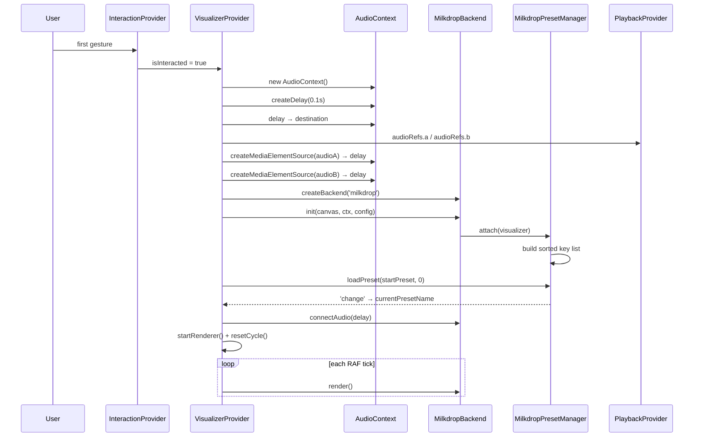
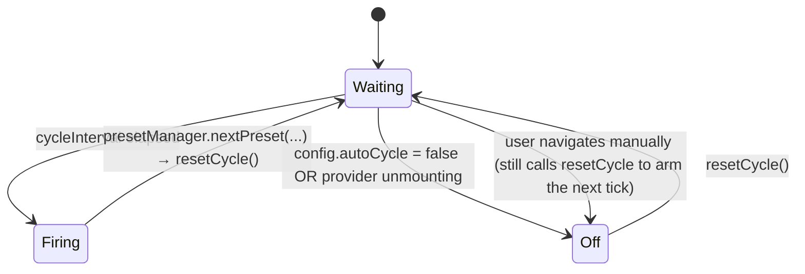
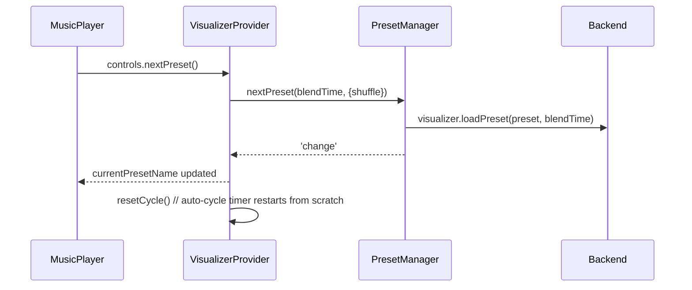
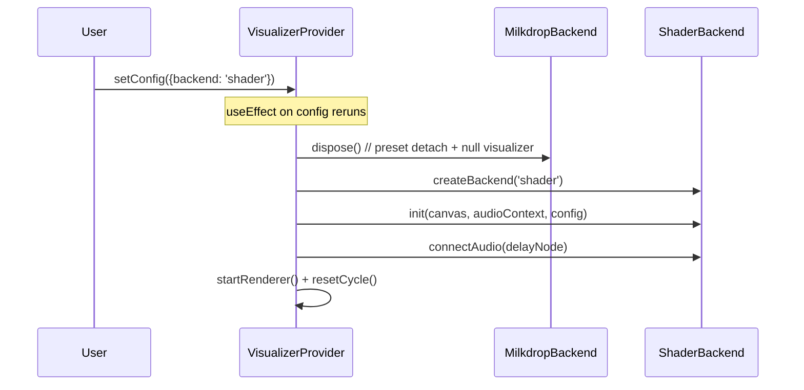

# Visualizer

The visualizer runs entirely inside VisualizerProvider. The React component
is a plain `<canvas>` that reads from a hook. All backend-specific work
happens behind two small contracts:

- **VisualizerBackend** — how to render one frame + own the GPU state.
- **PresetManager** — how to enumerate presets and cross-fade between them.

Two backends satisfy those contracts today:

- **MilkdropBackend** (butterchurn) — production.
- **ShaderBackend** (Shadertoy-flavored fragment shaders) — stub. Contract
  described below so the runtime shape is agreed before implementation.

## Objects

### VisualizerConfig — `src/visualizer/config.js`

Frozen defaults merged with any prop overrides at provider construction:

| Field | Purpose |
|---|---|
| `backend` | `'milkdrop'` \| `'shader'`. Switching triggers full backend teardown + re-init. |
| `width`, `height` | Canvas logical dimensions. |
| `pixelRatio` | Backing-store scale, defaults to `window.devicePixelRatio`. |
| `targetFps` | `0` = uncapped RAF; `N` caps to N frames per second inside the loop. |
| `blendTime` | Seconds spent morphing between presets on `next/prev/random/load`. |
| `autoCycle` | When `true`, presets advance every `cycleInterval` ms. |
| `cycleInterval` | ms between auto-advances. |
| `shufflePresets` | When true, auto-advance and `randomPreset()` pick uniformly at random. |
| `startPreset`, `useStartPreset` | If `useStartPreset` is true, load `startPreset` by name on init. Otherwise let shuffle pick. |
| `milkdrop.textureRatio` | butterchurn's internal FFT/warp resolution scale (< 1 = softer + cheaper). |
| `milkdrop.meshWidth` / `meshHeight` | FFT mesh detail; bigger = sharper warps, higher GPU cost. |
| `milkdrop.outputFXAA` | Anti-alias the final composite. |
| `shader.commonSource` | GLSL prepended to every preset (Shadertoy "Common" tab). |
| `shader.channels` | iChannel binding hints (`{kind: 'audioFFT'|'audioWave'|'texture'}`). |

### VisualizerBackend contract — `src/visualizer/backends/*.js`

```
name                                 : string
presetManager                        : PresetManager
async init(canvas, audioContext, config)  : allocate renderer + GL state
connectAudio(sourceNode)             : tap the audio graph for FFT
disconnectAudio()                    : release the tap
render()                             : draw one frame — called per RAF tick
resize(width, height)                : react to canvas size changes
dispose()                            : release everything, safe to re-init later
```

Backends **do not own**: the RAF loop, the cycle timer, the AudioContext, or
the MediaElementSource. All four are provider concerns so they survive
backend swaps.

### MilkdropBackend — `src/visualizer/backends/MilkdropBackend.js`

Wraps `butterchurn.createVisualizer(audioContext, canvas, {...})`. Forwards
config fields `width/height/pixelRatio/textureRatio/meshWidth/meshHeight/outputFXAA`
to butterchurn. `render()` = `visualizer.render()`.
`connectAudio(node)` calls `visualizer.connectAudio(node)`.

### ShaderBackend — `src/visualizer/backends/ShaderBackend.js` (stub)

Documented contract for when it lands:

1. Create a WebGL2 context on the shared canvas.
2. Compile per-preset program from
   `<preset.commonSource> + <preset.fragmentSource>` plus a Shadertoy
   prelude injecting these uniforms:
   ```
   uniform float iTime;
   uniform float iTimeDelta;
   uniform int   iFrame;
   uniform vec3  iResolution;
   uniform vec4  iMouse;
   uniform vec4  iDate;
   uniform sampler2D iChannel0; // FFT   (1D, width 512)
   uniform sampler2D iChannel1; // waveform (1D, width 512)
   uniform sampler2D iChannel2; // reserved
   uniform sampler2D iChannel3; // reserved
   ```
3. Feed `AnalyserNode` output into `iChannel0` / `iChannel1` textures each frame.
4. Render fullscreen quad into the canvas each frame; on preset change with
   `blendTime > 0`, render both programs to FBOs and mix by `t`.

Currently `init()` throws so misconfiguration surfaces immediately.

### PresetManager contract — `src/visualizer/presets/*.js`

```
attach(backendHandle)               : Promise<void> | void
detach()                            : release cache + listeners
list() : PresetMeta[]               : [{id, name}]
currentPreset                       : {id, name} | null
loadPreset(idOrName, blendTime)     : load + emit 'change'
nextPreset(blendTime, {shuffle})    : advance forward (or random)
prevPreset(blendTime)               : pop history, or fall back to (idx - 1)
randomPreset(blendTime)             : nextPreset(..., {shuffle:true})
subscribe(event, cb) : () => void   : currently only 'change'
```

**MilkdropPresetManager** attaches to a butterchurn visualizer, reads
`butterchurnPresets.getPresets()`, sorts keys case-insensitively, and delegates
`loadPreset` to `visualizer.loadPreset(preset, blendTime)`. `prevPreset`
pops from an internal history stack so back-navigation matches what the user
just saw.

**ShaderPresetManager** stub holds a `presets[]` array and throws on
`loadPreset`. Shape of a shader preset:
```
{
  name,
  fragmentSource,             // Shadertoy `mainImage` GLSL
  commonSource?,              // per-preset "Common" tab
  channels?: [{kind, src?}]   // per-preset iChannel bindings
}
```

### VisualizerProvider — `src/providers/VisualizerProvider.jsx`

**Properties (via `useVisualizer()`):**
- `canvasRef` — attach to the `<canvas>` element.
- `config` — merged config used by the current backend.
- `ready` — backend is initialised + first preset loaded.
- `error` — string | null.
- `enabled` — whether the render loop should be running.
- `frozen` — freeze frame; render loop is stopped without disconnecting audio
  or destroying state.
- `shufflePresets` — mirrors config default; toggled from UI.
- `currentPresetName` — updated whenever the preset manager emits `change`.
- `listPresets()` — returns `PresetMeta[]` for pickers.
- `controls` — see below.

**Controls (`controls.*`):**
- `nextPreset()`, `prevPreset()`, `randomPreset()` — presetManager delegation
  + `resetCycle()` so the auto-cycle timer restarts after manual navigation.
- `loadPreset(idOrName)` — jump to a specific preset by id or exact name.
- `freeze()`, `resume()`, `toggleFreeze()` — pause / resume RAF loop
  without touching audio.
- `setEnabled(bool | fn)` — toggle the renderer entirely. When `false`,
  canvas fades to `opacity-10`.
- `setShufflePresets(bool | fn)` — flips auto-advance policy.
- `resetCycle()` — restart the cycle timer (exposed for consumers that
  loaded a preset directly against the backend).

**Owned resources:**
- `canvasRef` — the DOM canvas.
- `backendRef` — current VisualizerBackend instance.
- `audioContextRef`, `delayNodeRef` — shared Web Audio graph;
  survives backend swaps.
- `sourceNodesRef` — `{a, b}`, one `MediaElementSource` **per audio slot**
  from `usePlayback().audioRefs`. Both are created once (bound to the
  audio element permanently by the browser) and both connect into
  `delayNode`. Only the active slot outputs sound; the FFT tap sees
  whichever is currently playing.
- `rafIdRef` — current RAF id, or `null` when the loop is stopped.
- `cycleTimeoutRef` — current cycle timer id.
- `shuffleRef` — mirror of state, read from inside the cycle tick closure.

**Event reactions:**
| Event | Reaction |
|---|---|
| `isInteracted` flips true | init AudioContext + delay (if not already), create a `MediaElementSource` **per audio slot** (A and B) and connect both into delay → destination, create backend from `config.backend`, `backend.init(...)`, subscribe to preset change events, load `startPreset`, `backend.connectAudio(delayNode)`, start RAF, start cycle timer. |
| `config` reference changes | full teardown of backend (dispose + clear refs), rerun init. AudioContext + source/delay/destination are kept. |
| `enabled` or `frozen` change (after `ready`) | start RAF if `enabled && !frozen`, stop otherwise. |
| `document.visibilitychange` → hidden | `stopRenderer()` — audio graph left connected, only the RAF loop is paused. |
| `document.visibilitychange` → visible | `startRenderer()` if `ready && enabled && !frozen`. |
| preset manager emits `'change'` | `setCurrentPresetName(preset.name)`. |
| manual `nextPreset`/`prevPreset`/`randomPreset`/`loadPreset` | delegate to preset manager, then `resetCycle()`. |
| provider unmounts | cancel RAF, clear cycle timer, `backend.dispose()`. |

## Flows

### Initialisation



### Preset cycle timer



### Manual next-preset from a hot key



### Backend swap (future)



The AudioContext and its `source → delay → destination` chain are preserved
across the swap, so audio never cuts.

### Freeze vs disable vs backend swap vs tab-hidden

| Action | RAF | Backend | Audio graph | Use case |
|---|---|---|---|---|
| `controls.freeze()` | stopped | kept | kept | pause visuals but keep music going |
| `controls.setEnabled(false)` | stopped | kept | kept | user hides the visualizer |
| `document.hidden = true` | stopped | kept | kept | mobile lockscreen / tab switch — audio keeps playing, GPU idles |
| backend swap | stopped → started | disposed → new | kept | switch renderer style |
| provider unmount | stopped | disposed | AudioContext closed with the app | teardown |

## Adding a new backend

1. Implement the VisualizerBackend contract in
   `src/visualizer/backends/<Name>Backend.js`.
2. Implement a PresetManager for it in `src/visualizer/presets/<Name>PresetManager.js`.
3. Add a `case '<name>':` branch in `createBackend()` inside VisualizerProvider.
4. Add a per-backend config sub-object under `DEFAULT_VISUALIZER_CONFIG`.

VisualizerProvider does not need to change further.
